# Variable-Based Code Flow Visualization

This document visualizes the Model Portfolio pipeline (`service/pipeline/`), strictly focusing on how **variables** are transformed through function calls across modules.

> 각 단계의 `[N]` 번호는 `model_portfolio.py:run()` 및 `README.md`와 동일합니다.

## Variable Flow Graph

```mermaid
graph TD
    %% Nodes representing Data/Variables
    classDef data fill:#e1f5fe,stroke:#01579b,stroke-width:2px;
    classDef func fill:#f3e5f5,stroke:#4a148c,stroke-width:2px,rx:10,ry:10;
    classDef file fill:#fff3e0,stroke:#e65100,stroke-width:2px,stroke-dasharray: 5 5;

    %% --- [1] Load Data ---
    File_Factor[("📄 {benchmark}_factor.parquet<br/>(팩터 데이터, factor_info merge 완료)")]:::file
    File_MRet[("📄 {benchmark}_mreturn.parquet<br/>(M_RETURN, 67K행)")]:::file
    File_Info[("📄 factor_info.csv")]:::file

    Func_Load{{"[1] _load_data + _prepare_metadata<br/>(pipeline-ready parquet 로드, M_RETURN 병합)"}}:::func

    Var_Raw("raw_data<br/>(pd.DataFrame)"):::data
    Var_MRet("market_return_df<br/>(pd.DataFrame)"):::data
    Var_Info("factor_metadata<br/>(pd.DataFrame)"):::data
    Var_Merged("merged_data<br/>(pd.DataFrame)"):::data

    File_Factor --> Func_Load
    File_MRet --> Func_Load
    File_Info --> Func_Load
    Func_Load --> Var_Raw & Var_MRet & Var_Info
    Var_Raw & Var_MRet & Var_Info --> Var_Merged

    %% --- [2] Factor Assignment ---
    Func_Assign{{"[2] calculate_factor_stats_batch<br/>(하이브리드: batch lag + per-factor rank/quantile)"}}:::func
    Var_DataList("factor_stats<br/>(list[tuple])"):::data

    Var_Merged --> Func_Assign
    Func_Assign --> Var_DataList
    note_DL["Tuple per factor:<br/>(sector_return_df, None, spread_series, merged_df)<br/>or (None,)*4"]
    Var_DataList -.-> note_DL

    %% --- [3] Filter & Label ---
    Func_Filter{{"[3] filter_and_label_factors<br/>(섹터 필터 + L/N/S 라벨링)"}}:::func
    Var_CleanedRaw("filtered_data<br/>(List[pd.DataFrame])"):::data
    Var_KeptLists("kept_abbrs, kept_names, kept_styles<br/>(List[str])"):::data

    Var_DataList --> Func_Filter
    Func_Filter --> Var_CleanedRaw
    Func_Filter --> Var_KeptLists

    %% --- [4] Evaluate Universe ---
    Func_GenMeta{{"[4] _evaluate_universe<br/>(aggregate_factor_returns → CAGR 랭킹 → top 50)"}}:::func
    Var_FacRet("return_matrix<br/>(pd.DataFrame)"):::data
    Var_DownCorr("correlation_matrix<br/>(pd.DataFrame)"):::data
    Var_Meta("meta<br/>(pd.DataFrame)"):::data

    Var_CleanedRaw & Var_KeptLists --> Func_GenMeta
    Func_GenMeta --> Var_FacRet
    Func_GenMeta --> Var_DownCorr
    Func_GenMeta --> Var_Meta

    %% --- [5] Optimize Mixes ---
    Func_GetWgt{{"[5] _optimize_mixes → find_optimal_mix<br/>(스타일별 메인-서브 그리드 탐색)"}}:::func
    Var_BestSub("best_sub<br/>(pd.DataFrame)"):::data
    Var_RetSubset("ret_subset<br/>(pd.DataFrame)"):::data

    Var_FacRet & Var_DownCorr & Var_Meta --> Func_GetWgt
    Func_GetWgt --> Var_BestSub
    Var_BestSub & Var_FacRet --> Var_RetSubset

    %% --- [6] Weight Determination ---
    Func_Sim{{"[6] simulate_constrained_weights<br/>(듀얼 모드: hardcoded/simulation)"}}:::func
    Var_Res("sim_result<br/>(best_stats, weights_tbl)"):::data

    Var_RetSubset --> Func_Sim
    Func_Sim --> Var_Res

    %% --- [7] Construct & Export ---
    Func_Construct{{"[7] _construct_and_export<br/>(종목별 비중 → MP 집계 → CSV 출력)"}}:::func
    Var_WeightRaw("weight_raw<br/>(pd.DataFrame)"):::data
    Var_AggW("agg_w (MP)<br/>(pd.DataFrame)"):::data
    Var_FinalWeights("final_weights<br/>(pd.DataFrame)"):::data
    Var_Pivoted("pivoted_final<br/>(pd.DataFrame)"):::data

    Var_Res & Var_CleanedRaw --> Func_Construct
    Func_Construct --> Var_WeightRaw
    Var_WeightRaw --> Var_AggW
    Var_WeightRaw & Var_AggW --> Var_FinalWeights
    Var_FinalWeights --> Var_Pivoted

    %% --- Files Output ---
    File_Total[("📄 total_aggregated_weights_*.csv")]:::file
    File_Style[("📄 total_aggregated_weights_style_*.csv")]:::file
    File_Pivot[("📄 pivoted_total_agg_wgt_*.csv")]:::file
    File_Meta[("📄 meta_data.csv")]:::file

    Var_FinalWeights --> File_Total
    Var_FinalWeights --> File_Style
    Var_Pivoted --> File_Pivot
    Var_Meta --> File_Meta

```

## Variable Descriptions

| Step | Variable | Description | Type | Source |
| :--- | :--- | :--- | :--- | :--- |
| `[1]` | `raw_data` | Pipeline-ready factor parquet에서 로드 (factorOrder 포함, M_RETURN 별도) | `pd.DataFrame` | `_load_data` |
| `[1]` | `market_return_df` | M_RETURN parquet에서 로드 (67K행, gvkeyiid × ddt) | `pd.DataFrame` | `_load_data` |
| `[1]` | `factor_metadata` | factor_info.csv 메타 정보 | `pd.DataFrame` | `_prepare_metadata` |
| `[1]` | `merged_data` | raw_data + M_RETURN 병합 결과 (pipeline-ready면 factor_info merge 생략) | `pd.DataFrame` | `_prepare_metadata` |
| `[2]` | `factor_stats` | 팩터별 분석 결과 (sector_return, spread, merged_df) | `list[tuple]` | `calculate_factor_stats_batch` |
| `[3]` | `filtered_data` | 섹터 필터 + label 부여된 종목 데이터 | `List[pd.DataFrame]` | `filter_and_label_factors` |
| `[3]` | `kept_abbrs/names/styles` | 유지된 팩터 메타 리스트 | `List[str]` | `filter_and_label_factors` |
| `[4]` | `return_matrix` | 월간 net return 매트릭스 (top 50 팩터) | `pd.DataFrame` | `_evaluate_universe` |
| `[4]` | `correlation_matrix` | 하락 상관관계 행렬 | `pd.DataFrame` | `_evaluate_universe` |
| `[4]` | `meta` | 팩터 성과/랭크 테이블 (CAGR, rank_style, rank_total) | `pd.DataFrame` | `_evaluate_universe` |
| `[5]` | `best_sub` | 최적 메인+서브 팩터 조합 | `pd.DataFrame` | `_optimize_mixes` |
| `[5]` | `ret_subset` | 선정된 팩터들의 수익률 행렬 subset | `pd.DataFrame` | `_optimize_mixes` |
| `[6]` | `sim_result` | (best_stats, weights_tbl) — 최적 비중 결과 | `Tuple` | `simulate_constrained_weights` |
| `[7]` | `weight_raw` | 팩터별 종목 가중치 | `pd.DataFrame` | `_construct_and_export` |
| `[7]` | `agg_w` | MP (팩터 통합) 가중치 | `pd.DataFrame` | `_construct_and_export` |
| `[7]` | `final_weights` | weight_raw + agg_w 결합 | `pd.DataFrame` | `_construct_and_export` |
| `[7]` | `pivoted_final` | 피벗 형태 (Optimizer 연동용) | `pd.DataFrame` | `_construct_and_export` |
