# Variable-Based Code Flow Visualization

This document visualizes the Model Portfolio pipeline (`service/pipeline/`), strictly focusing on how **variables** are transformed through function calls across modules.

## Variable Flow Graph

```mermaid
graph TD
    %% Nodes representing Data/Variables
    classDef data fill:#e1f5fe,stroke:#01579b,stroke-width:2px;
    classDef func fill:#f3e5f5,stroke:#4a148c,stroke-width:2px,rx:10,ry:10;
    classDef file fill:#fff3e0,stroke:#e65100,stroke-width:2px,stroke-dasharray: 5 5;

    %% --- Load Data ---
    File_Parquet[("📄 *.parquet")]:::file
    File_Info[("📄 factor_info.csv")]:::file
    
    Func_Load{{"pd.read_parquet / read_csv"}}:::func
    
    Var_Query("raw_factor_data_df<br/>(pd.DataFrame)"):::data
    Var_Info("factor_metadata_df<br/>(pd.DataFrame)"):::data
    
    File_Parquet --> Func_Load --> Var_Query
    File_Info --> Func_Load --> Var_Info

    %% --- Merge & Prep ---
    Func_Merge{{"merge & groupby<br/>(데이터 병합/그룹화)"}}:::func
    Var_Merged("merged_factor_data_df<br/>(pd.DataFrame)"):::data
    Var_MRet("market_return_df<br/>(pd.DataFrame)"):::data
    Var_Grouped("grouped_source_data<br/>(DataFrameGroupBy)"):::data

    Var_Query & Var_Info --> Func_Merge
    Func_Merge --> Var_Merged
    Var_Query --> Func_Merge --> Var_MRet
    Var_Merged --> Func_Merge --> Var_Grouped

    %% --- Factor Assignment ---
    Func_Assign{{"factor_analysis.calculate_factor_stats<br/>(팩터 통계/분위 계산)"}}:::func
    Var_DataList("processed_factor_data_list<br/>(List[Tuple])"):::data

    Var_Grouped & Var_MRet --> Func_Assign
    Func_Assign --> Var_DataList
    note_DL["List of Tuples:<br/>(sector_return_df, quantile_return_df, spread_series, merged_df)"]
    Var_DataList -.-> note_DL

    %% --- Filter ---
    Func_Filter{{"factor_analysis.filter_and_label_factors<br/>(필터링 및 라벨링)"}}:::func
    Var_CleanedRaw("filtered_factor_data_list<br/>(List[pd.DataFrame])"):::data
    Var_KeptLists("kept_factor_abbrs...<br/>(List[str])"):::data

    Var_DataList --> Func_Filter
    Func_Filter --> Var_CleanedRaw
    Func_Filter --> Var_KeptLists

    %% --- Meta Generation ---
    Func_GenMeta{{"Pipeline._evaluate_universe<br/>(메타/성과지표 생성)"}}:::func
    Var_FacRet("monthly_return_matrix<br/>(pd.DataFrame)"):::data
    Var_DownCorr("downside_correlation_matrix<br/>(pd.DataFrame)"):::data
    Var_PerfMet("factor_performance_metrics<br/>(pd.DataFrame)"):::data

    Var_CleanedRaw --> Func_GenMeta
    Func_GenMeta --> Var_FacRet
    Func_GenMeta --> Var_DownCorr
    Func_GenMeta --> Var_PerfMet

    %% --- Optimization (Grid Search) ---
    %% --- Optimization (Grid Search) ---
    %% --- Optimization (Grid Search) ---
    Func_GetWgt{{"optimization.find_optimal_mix loops<br/>(최적 조합 탐색)"}}:::func
    Var_TopMetrics("top_metrics<br/>(pd.DataFrame)"):::data
    Var_MixGrid("mix_grid<br/>(pd.DataFrame)"):::data
    
    Var_PerfMet --> Var_TopMetrics
    Var_FacRet & Var_DownCorr & Var_TopMetrics --> Func_GetWgt
    Func_GetWgt --> Var_MixGrid

    %% --- Selection ---
    Func_Select{{"Best Selection<br/>(최적 팩터 선정)"}}:::func
    Var_BestSub("best_sub<br/>(pd.DataFrame)"):::data
    Var_RetSubset("ret_subset<br/>(pd.DataFrame)"):::data

    Var_MixGrid --> Func_Select
    Func_Select --> Var_BestSub
    Var_BestSub & Var_FacRet --> Var_RetSubset

    %% --- Simulation ---
    %% --- Simulation ---
    %% --- Simulation ---
    Func_Sim{{"optimization.simulate_constrained_weights<br/>(듀얼 모드: hardcoded/simulation)"}}:::func
    Var_Res("sim_result<br/>(Tuple)"):::data
    note_Res["Tuple:<br/>(best_stats, weights_tbl)<br/>mode=hardcoded: 프로덕션<br/>mode=simulation: 몬테카를로"]
    
    Var_RetSubset --> Func_Sim
    Func_Sim --> Var_Res
    Var_Res -.-> note_Res

    %% --- Weight Construction ---
    Func_Construct{{"Pipeline._construct_and_export<br/>(비중 계산 및 출력)"}}:::func
    Var_WeightFrames("weight_frames<br/>(List[pd.DataFrame])"):::data
    Var_WeightRaw("weight_raw<br/>(pd.DataFrame)"):::data
    
    Var_Res & Var_CleanedRaw --> Func_Construct
    Func_Construct --> Var_WeightFrames
    Var_WeightFrames --> Var_WeightRaw

    %% --- Aggregation & Final Output ---
    Func_Agg{{"Aggregation & Pivot<br/>(집계 및 피벗)"}}:::func
    Var_AggW("agg_w<br/>(pd.DataFrame)"):::data
    Var_FinalWeights("final_weights<br/>(pd.DataFrame)"):::data
    Var_Pivoted("pivoted_final<br/>(pd.DataFrame)"):::data
    
    Var_WeightRaw --> Func_Agg
    Func_Agg --> Var_AggW
    Var_WeightRaw & Var_AggW --> Var_FinalWeights
    Var_FinalWeights --> Func_Agg --> Var_Pivoted

    %% --- Files Output ---
    File_AggW[("📄 aggregated_weights_*.csv")]:::file
    File_Total[("📄 total_aggregated_weights_*.csv")]:::file
    File_Style[("📄 total_aggregated_weights_style_*.csv")]:::file
    File_Final[("📄 final_pivot_*.csv")]:::file

    Var_AggW --> File_AggW
    Var_FinalWeights --> File_Total
    Var_FinalWeights --> File_Style
    Var_Pivoted --> File_Final

```

## Variable Descriptions

| Variable | Description | Type | Source Module |
| :--- | :--- | :--- | :--- |
| `raw_factor_data_df` | Raw factor data loaded from Parquet. | `pd.DataFrame` | `model_portfolio` (`_load_data`) |
| `factor_metadata_df` | Joined data of raw factors + factor info. | `pd.DataFrame` | `model_portfolio` (`_prepare_metadata`) |
| `processed_factor_data_list` | List of results from `calculate_factor_stats` for each factor. Contains sector returns, quantile returns, spreads, and merged data. | `List[Tuple]` | `factor_analysis` |
| `filtered_factor_data_list` | Filtered list of factor DataFrames (removing those with negative Q-spreads). | `List[pd.DataFrame]` | `factor_analysis` |
| `monthly_return_matrix` | Matrix of individual factor returns (Index: Date, Col: Factor). | `pd.DataFrame` | `pipeline_utils` → `model_portfolio` (`_evaluate_universe`) |
| `downside_correlation_matrix` | Downside correlation matrix between factors. | `pd.DataFrame` | `correlation` |
| `factor_performance_metrics` | Metrics (CAGR, Rank) for each factor. | `pd.DataFrame` | `model_portfolio` (`_evaluate_universe`) |
| `mix_grid` | Results of the grid search optimization for Main/Sub factor pairs. | `pd.DataFrame` | `optimization` (`find_optimal_mix`) |
| `best_sub` | The top selected Main+Sub factor combinations. | `pd.DataFrame` | `model_portfolio` (`_optimize_mixes`) |
| `ret_subset` | Subset of returns for only the selected Main/Sub factors. | `pd.DataFrame` | `model_portfolio` (`_optimize_mixes`) |
| `sim_result` | Result of weight determination (dual mode: hardcoded or Monte Carlo). Contains `best_stats` and `weights_tbl`. | `Tuple` | `optimization` (`simulate_constrained_weights`) |
| `weight_frames` | List of DataFrames, each containing calculated weights for tickers for a specific factor/style. | `List[pd.DataFrame]` | `model_portfolio` (`_construct_and_export`) |
| `final_weights` | Combined DataFrame of all individual factor weights + aggregated total weights (`MP` style). | `pd.DataFrame` | `model_portfolio` (`_construct_and_export`) |
