# Variable-Based Code Flow Visualization

This document visualizes the `model_portfolio.py` pipeline, strictly focusing on how **variables** are transformed through function calls.

## Variable Flow Graph

```mermaid
graph TD
    %% Nodes representing Data/Variables
    classDef data fill:#e1f5fe,stroke:#01579b,stroke-width:2px;
    classDef func fill:#f3e5f5,stroke:#4a148c,stroke-width:2px,rx:10,ry:10;
    classDef file fill:#fff3e0,stroke:#e65100,stroke-width:2px,stroke-dasharray: 5 5;

    %% --- Load Data ---
    File_Parquet[("📄 *.parquet")]:::file
    File_Info[("📄 factor_info.csv")]:::file
    
    Func_Load{{"pd.read_parquet / read_csv"}}:::func
    
    Var_Query(query):::data
    Var_Info(info):::data
    
    File_Parquet --> Func_Load --> Var_Query
    File_Info --> Func_Load --> Var_Info

    %% --- Merge & Prep ---
    Func_Merge{{merge & groupby}}:::func
    Var_Merged(merged_source_data):::data
    Var_MRet(m_ret):::data
    Var_Grouped(grouped_source_data):::data

    Var_Query & Var_Info --> Func_Merge
    Func_Merge --> Var_Merged
    Var_Query --> Func_Merge --> Var_MRet
    Var_Merged --> Func_Merge --> Var_Grouped

    %% --- Factor Assignment ---
    Func_Assign{{_assign_factor}}:::func
    Var_DataList(data_list):::data

    Var_Grouped & Var_MRet --> Func_Assign
    Func_Assign --> Var_DataList
    note_DL["List of Tuples:<br/>(sector_ret, quantile_ret, spread, merged)"]
    Var_DataList -.-> note_DL

    %% --- Filter ---
    Func_Filter{{_filter_grouped}}:::func
    Var_CleanedRaw(cleaned_raw):::data
    Var_KeptLists("kept_abbr, kept_name..."):::data

    Var_DataList --> Func_Filter
    Func_Filter --> Var_CleanedRaw
    Func_Filter --> Var_KeptLists

    %% --- Meta Generation ---
    Func_GenMeta{{_generate_meta}}:::func
    Var_FacRet(factor_return_matrix):::data
    Var_DownCorr(downside_correlation_matrix):::data
    Var_PerfMet(factor_performance_metrics):::data

    Var_CleanedRaw --> Func_GenMeta
    Func_GenMeta --> Var_FacRet
    Func_GenMeta --> Var_DownCorr
    Func_GenMeta --> Var_PerfMet

    %% --- Optimization (Grid Search) ---
    Func_GetWgt{{_get_wgt loops}}:::func
    Var_TopMetrics(top_metrics):::data
    Var_MixGrid(mix_grid):::data
    
    Var_PerfMet --> Var_TopMetrics
    Var_FacRet & Var_DownCorr & Var_TopMetrics --> Func_GetWgt
    Func_GetWgt --> Var_MixGrid

    %% --- Selection ---
    Func_Select{{Best Selection}}:::func
    Var_BestSub(best_sub):::data
    Var_RetSubset(ret_subset):::data

    Var_MixGrid --> Func_Select
    Func_Select --> Var_BestSub
    Var_BestSub & Var_FacRet --> Var_RetSubset

    %% --- Simulation ---
    Func_Sim{{random_style_capped_sim}}:::func
    Var_Res(res):::data
    note_Res["Tuple:<br/>(best_stats, weights_tbl)"]
    
    Var_RetSubset --> Func_Sim
    Func_Sim --> Var_Res
    Var_Res -.-> note_Res

    %% --- Weight Construction ---
    Func_Construct{{Weight Construction Loop}}:::func
    Var_WeightFrames(weight_frames):::data
    Var_WeightRaw(weight_raw):::data
    
    Var_Res & Var_CleanedRaw --> Func_Construct
    Func_Construct --> Var_WeightFrames
    Var_WeightFrames --> Var_WeightRaw

    %% --- Aggregation & Final Output ---
    Func_Agg{{Aggregation & Pivot}}:::func
    Var_AggW(agg_w):::data
    Var_FinalWeights(final_weights):::data
    Var_Pivoted(pivoted_final):::data
    
    Var_WeightRaw --> Func_Agg
    Func_Agg --> Var_AggW
    Var_WeightRaw & Var_AggW --> Var_FinalWeights
    Var_FinalWeights --> Func_Agg --> Var_Pivoted

    %% --- Files Output ---
    File_AggW[("📄 aggregated_weights_*.csv")]:::file
    File_Total[("📄 total_aggregated_weights_*.csv")]:::file
    File_Style[("📄 total_aggregated_weights_style_*.csv")]:::file
    File_Final[("📄 final_pivot_*.csv")]:::file

    Var_AggW --> File_AggW
    Var_FinalWeights --> File_Total
    Var_FinalWeights --> File_Style
    Var_Pivoted --> File_Final

```

## Variable Descriptions

| Variable | Description | Type | Source |
| :--- | :--- | :--- | :--- |
| `query` | Raw factor data loaded from Parquet. | `pd.DataFrame` | `*.parquet` |
| `merged_source_data` | Joined data of raw factors + info info. | `pd.DataFrame` | `query` + `info` |
| `data_list` | List of results from `_assign_factor` for each factor. Contains sector returns, quantile returns, spreads, and merging basic data. | `List[Tuple]` | `_assign_factor` |
| `cleaned_raw` | Filtered list of factor DataFrames (removing those with negative Q-spreads). | `List[pd.DataFrame]` | `_filter_grouped` |
| `factor_return_matrix` | Matrix of individual factor returns (Index: Date, Col: Factor). | `pd.DataFrame` | `_generate_meta` |
| `factor_performance_metrics` | Metrics (CAGR, Rank) for each factor. | `pd.DataFrame` | `_generate_meta` |
| `mix_grid` | Results of the grid search optimization for Main/Sub factor pairs. | `pd.DataFrame` | `_get_wgt` loop |
| `best_sub` | The top selected Main+Sub factor combinations. | `pd.DataFrame` | Selection logic from `mix_grid` |
| `ret_subset` | Subset of returns for only the selected Main/Sub factors. | `pd.DataFrame` | `factor_return_matrix` |
| `res` | Result of the Monte Carlo simulation. Contains `best_stats` and `weights_tbl`. | `Tuple` | `random_style_capped_sim` |
| `weight_frames` | List of DataFrames, each containing calculated weights for tickers for a specific factor/style. | `List[pd.DataFrame]` | Loop over `res[1]` |
| `final_weights` | Combined DataFrame of all individual factor weights + aggregated total weights (`MP` style). | `pd.DataFrame` | `weight_raw` + `agg_w` |
